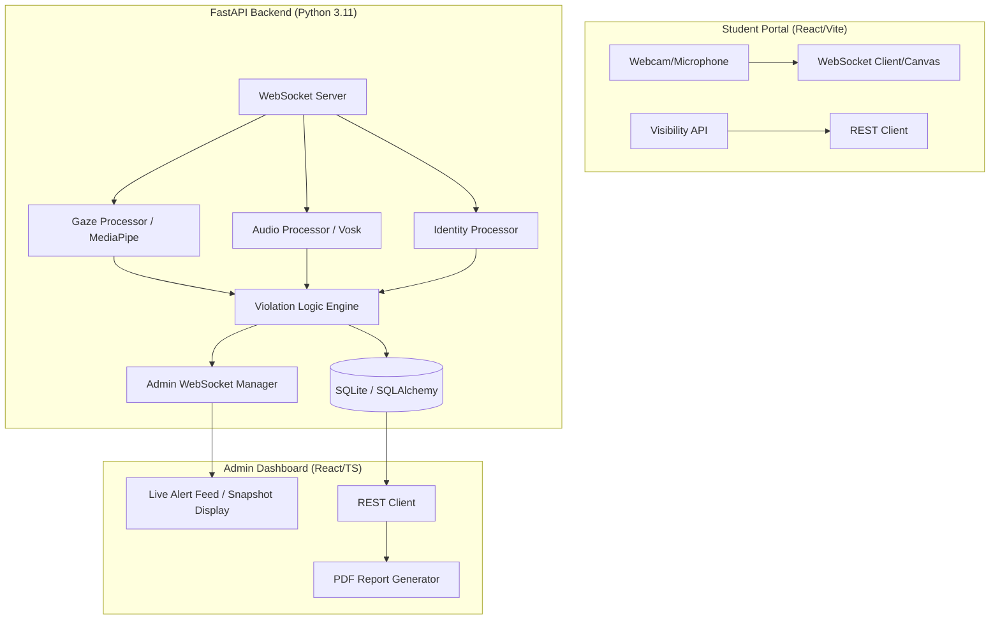

# 🎓 Intelligent Exam Proctoring System
[](https://www.python.org/)
[](https://react.dev/)
[](https://fastapi.tiangolo.com/)
[](https://developers.google.com/mediapipe)
[](#)

A state-of-the-art, **fully offline, real-time AI-powered** exam proctoring solution. This system monitors students via webcam and microphone, detecting suspicious behavior using advanced Computer Vision and Speech-to-Text models, while providing a live administrative dashboard for centralized monitoring.

---

## 🚀 Key Features

- **👁️ Intelligent Gaze Tracking**: Detects eye darting and iris position relative to head pose to catch off-screen cheating.
- **👤 Identity Re-Authentication**: Continually verifies the student's face using a unique biological "signature" to prevent person-swapping.
- **🎙️ Local Audio Analysis**: Uses the **Vosk** STT engine to detect talking and whispering without an internet connection.
- **📐 3D Head Pose Estimation**: Monitors head yaw (turning) and pitch (tilt) using 468 MediaPipe FaceMesh landmarks.
- **🛡️ Anti-Switching Protection**: Detects browser tab switching and window blurring events.
- **📊 Real-time Dashboard**: Live WebSocket alerts and student trust scores (starts at 100%, drains on violations).
- **📄 Audit Reporting**: Generates detailed PDF violation reports with timestamps and proof snapshots.

---

## 🏗️ System Architecture



---

## 🧠 Technical Deep-Dive

### 1. Adaptive Gaze & Pose Estimation
Unlike simple gaze trackers, our engine uses **Compensation Logic**. It understands that a head turn requires a counter-eye movement to stay focused on the screen. If the head turns but the eyes don't compensate, a violation is flagged.
- **Head Yaw/Pitch**: Calculated via ratios of landmarks (Nose to Ear-Edges vs. Forehead to Chin).
- **Iris Tracking**: Iris center vs. Eye corner distance ratios.

### 2. Biological Identity Signatures
Instead of continuous heavy face encoding comparison, we use a **Topological Signature** approach:
- We calculate 10+ normalized ratios between fixed skeletal landmarks (Inter-eye distance, nose-to-chin, mouth-width).
- This "signature" is compared against a baseline established during enrollment using Mean Squared Error (MSE).
- If the deviation exceeds a 20% tolerance, a "Wrong Person" alert is triggered.

### 3. Edge Speech Processing
The system integrates **Vosk**, a Kaldi-based speech recognition toolkit that runs entirely on device. It processes 16kHz PCM audio chunks via WebSockets to detect spoken phrases in real-time.

---

## 🛠️ Project Structure

```bash
DL-Project1/
├── backend/                # FastAPI Server
│   ├── main.py             # API Entry Point
│   ├── database.py         # SQLAlchemy Setup
│   ├── services/           # ML Core Logic
│   │   ├── gaze_processor.py      # FaceMesh & Gaze
│   │   ├── audio_processor.py     # Vosk Audio Pipeline
│   │   └── identity_processor.py  # Face Signature Matching
│   └── requirements.txt    # Python Dependencies
├── frontend/               # React TypeScript (Vite)
│   ├── src/
│   │   ├── components/     # Student Portal & Admin Dashboard
│   │   └── App.tsx         # Routing
│   └── package.json        # Node.js Dependencies
├── public/
│   └── snapshots/          # Persisted Violation Photos
└── run_network.py          # Local Network Helper Script
```

---

## 🏁 Getting Started

### Prerequisites
- Python 3.11+
- Node.js 18+
- [FFmpeg](https://ffmpeg.org/) (Recommended for audio processing)

### Installation

1. **Clone the repository**
   ```bash
   git clone https://github.com/your-repo/dl-project1.git
   cd dl-project1
   ```

2. **Backend Setup**
   ```bash
   cd backend
   pip install -r requirements.txt
   # Download Vosk model to 'backend/model/' if not present
   ```

3. **Frontend Setup**
   ```bash
   cd ../frontend
   npm install
   ```

---

## 🏃 Running the Application

### Option A: Manual (Local Only)
1. **Start Backend**: `cd backend && python main.py`
2. **Start Frontend**: `cd frontend && npm run dev`
3. Visit `http://localhost:5173`

### Option B: Local Network (Shared Access)
Run the network helper to allow other laptops on the same Wi-Fi to join:
```bash
python run_network.py
```
This script will identify your IP and display the URLs for the Student Portal.

---

## 🔒 Security & Privacy
- **Zero Cloud Reliance**: No data is sent to external servers. All ML models (MediaPipe, Vosk) and databases (SQLite) reside on your machine.
- **Ephemeral Snapshots**: Violation snapshots are stored locally and only served to the authenticated Admin Dashboard.
